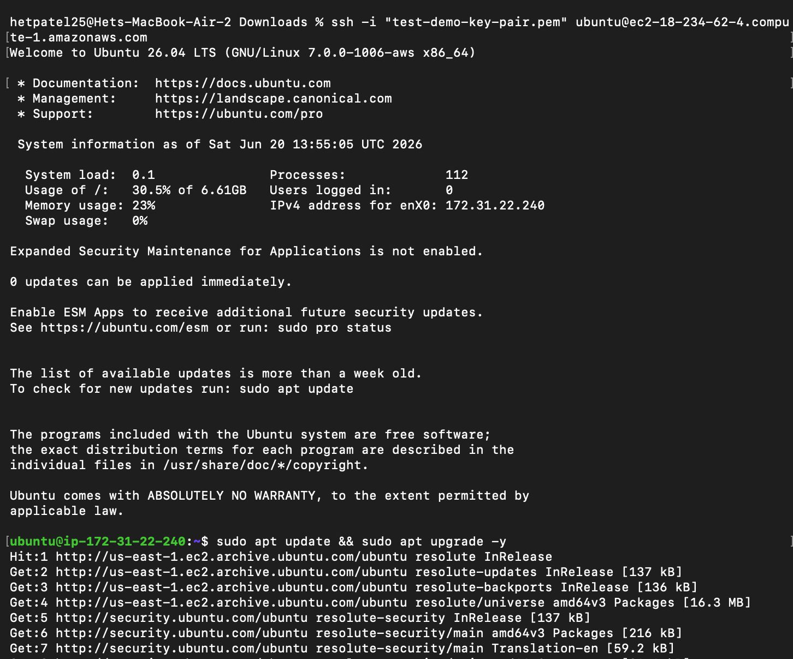
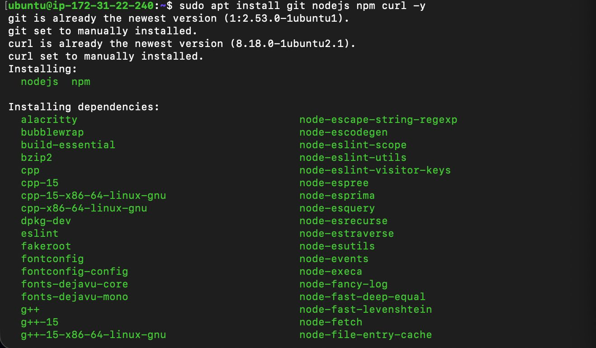
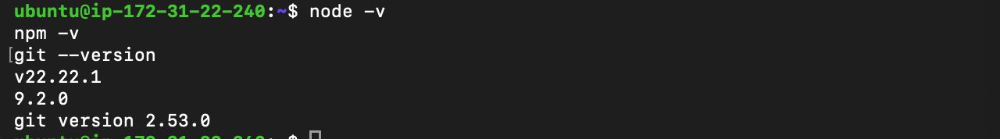

# Launching & Configuring EC2 Instances

## Project Overview
I Was Given A Task To Launch And Configure An EC2 Instance On My AWS Account Here Is The Step By Step  Procces How Did I Acconplish It
---

## Part 1:  Configuring AWS EC2 Instances

### Step 1: Virtual Server Provisioning

* **Implementation Parameters:**
  * **Operating System Image (AMI):** `Ubuntu Server 26.04 LTS (HVM), SSD Volume Type` (amd64 architecture). Chosen for its stability, built-in security patches, wide package manager compatibility, and zero software licensing costs.
  * **Instance Sizing:** `t3.micro` (or `t2.micro` based on local edge availability zone presets). This engine allocation balances CPU burstability and system memory optimal for test application workloads.
  * **Storage Allocation:** Initialized a root Amazon Elastic Block Store (EBS) volume allocated at `8 GiB` utilizing General Purpose SSD volume structures.
  * **Access Token Generation:** Generated an asymmetric RSA credential security pair named `test-demo-key-pair.pem` and downloaded the private key component securely to the local workstation workspace.


####  Instance Confirmation Dashboard


### Step 2: Local Environment Configuration & Key Access Restrictions
* **Action:** Restructured file-level permissions of the security credentials via a local Mac terminal interface.
* **Implementation:** 1. Navigated to the location of the private credential within the local file system:
     ```bash
     cd ~/Downloads
     ```


     

#  Local Key Permissions & Initial SSH Connection



   2. Overrode broad operating system default folder permissions to satisfy strict SSH validation parameters. Public and system broadcast read privileges were stripped from the file using the POSIX command utility:
     ```bash
     chmod 400 test-demo-key-pair.pem
     ```
     *Note: This security modification mitigates explicit error blocks where an exposed private key token is rejected by remote server nodes for being too vulnerable.*


      

### Step 3: Establishing Remote Cloud Connections
* **Action:** Initialized an encrypted cryptographic tunnel connection directly into the remote AWS hypervisor framework.
* **Implementation:** Executed an SSH routing command targeting the public DNS endpoint of the live node, using the default native user access group assigned to Ubuntu images:
  ```bash
  ssh -i "test-demo-key-pair.pem" ubuntu@ec2-18-234-62-4.compute-1.amazonaws.com


  ### 🖥️ Deployment & Configuration Steps


#### System Package Diagnostics



#### Final Server Infrastructure Setup

